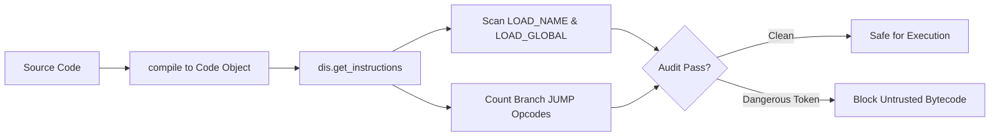

# GenPark Bytecode Disassembler Instruction Auditor Skill

Python bytecode inspection and opcode auditor evaluating instruction safety and control-flow jumps.

Find more agent tools at [GenPark](https://genpark.ai) and the [GenPark MCP Catalog](https://genpark.ai/mcp).

## Features
- In-memory opcode disassembly with standard library `dis`.
- Detection of dangerous dynamic execution builtins.
- Zero external dependencies.
